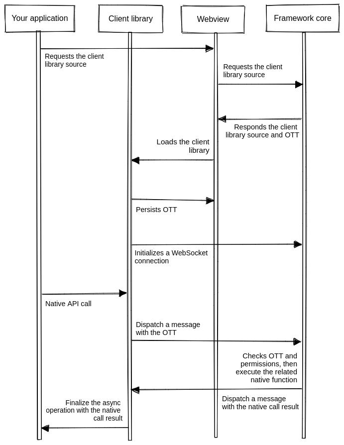

Security is typically a hidden layer in software systems, but it is as crucial as all other elements in a
good quality software system. Application security is a user's right and a developer's responsibility for
preventing various digital attacks. Also, the security-first design is a mandatory design principle for
modern software systems due to the increasing number of computer users.

We use the following strategies to strengthen the framework's security layer.

## Port security and authentication

Once you study the [Neutralinojs architecture](architecture.md), you will notice that the framework frontend communicates with
the framework core via a WebSocket-based network port. Developers who know the operating system internals
will argue that the Neutralinojs framework is vulnerable due to the local port-based IPC.

Let's understand it this way. The network is undoubtedly vulnerable, but network security strategies make
networks secure for every computer user&mdash;that's how we trust the internet today. Similarly, Neutralinojs
uses the One-Time-Token (OTT) strategy to prevent possible port scanning attacks.

Here is how the Neutralinojs local port is secured:

- The Neutralinojs framework's authentication module generates the OTT during the initialization process.
- When the user loads the client-library script, the framework sends the OTT only once.
- The client library stores the OTT in the local storage for future usage&mdash;the framework never sends the OTT again to the frontend. Depending on the current application mode, the client library stores the OTT in either webview or web browser.
- The OTT is used to verify every native API function call before execution.

The following criteria need to be satisfied for executing an arbitrary API function via a malicious
webpage (local or remote) or program:

- The specific malicious component needs to capture the OTT before the original application obtains the
OTT from the framework core. This attacking strategy is not practical because of the fast application
startup and lack of faster ways to access operating system-level process status. Even though someone
manages to detect the application startup, the original application requests OTT before the malicious
program (The framework sends OTT only once). On the other hand, malicious programs don't need Neutralinojs
to damage your computer system, so use programs you only trust.

- Even the OTT request process is not possible with modern web browsers via remote pages due to CORS-like
security strategies. Also, we don't even enable the native API for remote pages due to strict application
security.

- If there is a way (there is no proven approach yet) to crack OTT, native API access controls protect the
user's computer.

## Native API access control and authorization

The OTT strategy provides authentication for native API access by preventing
invalid/vulnerable client connections. The OTT grants access to the native API, but it doesn't give access
to everything. Most modern popular application runtimes provide access to everything without proper access
control. In the Neutralinojs native API model, developers need to mention the APIs they need explicitly for
better security.

Developers can define API permission requirements via the native allowlist or blocklist features.
The Neutralinojs native API permission system provides authorization support by validating incoming
requests with the pre-defined permission matrices.

Look at the following authentication/authorization diagram for more details:

Read our [security policy](https://github.com/neutralinojs/neutralinojs/security/policy)
to learn how to handle security-related framework issues.
