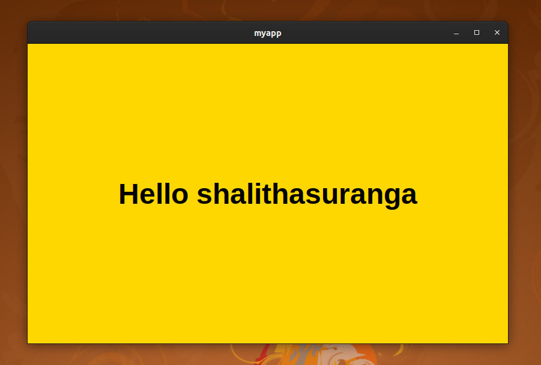

import Tabs from '@theme/Tabs';
import TabItem from '@theme/TabItem';

## Introduction

We are going to create a simple application using Neutralinojs. This sample application will display Hello with the
current username of your operating system. For example, if the current username is John, it will show, Hello John.

:::note
This tutorial uses Vanilla JavaScript for building the app. If you would like to use a frontend library,
check [this guide](./using-frontend-libraries.md).
:::

## Step 0: Installing neu CLI
You need to install neu CLI to create Neutralinojs applications. However, you can develop applications without CLI as well.
But, the CLI will make some hard stuff easy. Run the following command on your terminal to install neu CLI globally.
```bash
npm install -g @neutralinojs/neu
```

If you don't want a global installation, use neu CLI with npx.

```bash
npx @neutralinojs/neu <command>
```

## Step 1: Creating a new app

Enter the following command to scaffold a new app.

```
neu create myapp
```

The above command will create a new app inside myapp directory. To make sure whether everything is fine,
run your application.
```
cd myapp
neu run
```

:::info
If you are on Windows, you might get a blank white screen.
The reason for this is, accessing localhost from a UWP context is disabled by default.
Run the following command with administrative privileges on the command prompt to fix this.
```
CheckNetIsolation.exe LoopbackExempt -a -n="Microsoft.Win32WebViewHost_cw5n1h2txyewy"
```
You may include this in your Windows setup files (with the user's consent) because users also may get an empty white screen on Windows.

For better developer experience, we recommend you to install the [WebView2 runtime](https://developer.microsoft.com/en-us/microsoft-edge/webview2/#download-section) on Windows.
:::

## Step 2: Writing JavaScript, HTML, and CSS
Insert the following content into your application resource files.

<Tabs
  defaultValue="index.html"
  values={[
    {label: 'index.html', value: 'index.html'},
    {label: 'styles.css', value: 'styles.css'},
    {label: 'main.js', value: 'main.js'},
  ]}>
  <TabItem value="index.html">

  ```html
  <!DOCTYPE html>
  <html>
    <head>
      <meta charset="UTF-8">
      <title>NeutralinoJs</title>
      <link rel="stylesheet" href="styles.css">
    </head>
    <body>
      <div id="neutralinoapp">
        <h1 id="name"></h1>
      </div>
      <script src="js/neutralino.js"></script>
      <script src="js/main.js"></script>
    </body>
  </html>
  ```

  </TabItem>
  <TabItem value="styles.css">

  ```css
  html, body{
      margin: 0px;
      padding: 0px;
  }

  #neutralinoapp {
      position: absolute;
      width: 100%;
      height: 100%;
      background: #FFD700;
  }

  #neutralinoapp h1 {
      position: relative;
      float: left;
      top: 50%;
      left: 50%;
      transform: translate(-50%, -50%);
      font-family: Arial;
      font-size: 48px;
      padding: 0px;
      margin: 0px;
  }
  ```

  </TabItem>
  <TabItem value="main.js">

  ```js
  let getUsername = async () => {
    const key = NL_OS == 'Windows' ? 'USERNAME' : 'USER';
    let value = '';
    try {
        value = await Neutralino.os.getEnv(key);
    }
    catch(err) {
        console.error(err);
    }
    document.getElementById('name').innerText = `Hello ${value}`;
  }

  Neutralino.init();
  Neutralino.events.on("windowClose", () => {
    Neutralino.app.exit();
  });
  getUsername();
  ```

  </TabItem>
</Tabs>

Neutralinojs prevents arbitary native API function execution unlike Node.js environments.
Here we used the `os.getEnv` native function, so check whether your application configuration allows
the application frontend to execute it. The default configuration already allows the entire `os` namespace
with the following `nativeAllowList` permission setup:

```json
"nativeAllowList": [
    "app.*",
    "os.*",
    "debug.log"
],
```

We don't need to update anything in the permission setup since it already allows `os.getEnv` native function
calls.

:::info
**Note for Windows Users:**  
If you encounter the following error when running `neu` commands: 

File C:\Users\KRISH\AppData\Roaming\npm\neu.ps1 cannot be loaded because running scripts is disabled on this system.
For more information, see about_Execution_Policies at https://go.microsoft.com/fwlink/?LinkID=135170.


This issue occurs due to PowerShell's script execution policy. To resolve it, open PowerShell as an administrator and run:

`Set-ExecutionPolicy -Scope CurrentUser -ExecutionPolicy RemoteSigned`
:::

## Step 3: Running your application

As mentioned above, you can use the `run` command to start your application.
```
neu run
```
Congrats! your application works.



:::info
The `neu run` command will reload your application when there is a change in application resources.
Try to change your `index.html` while the application is running.
:::

## Step 4: Building your application 
To make portable binaries for your application, we can use the `build` command.
Enter the following command on your terminal to make final binaries for all supported platforms. 

```
neu build --release
```

The above command will produce binaries for all platforms into the `dist` directory and the `--release` flag will also package your binaries into a .zip file.
This command will do the work blazing fast because there is no compilation process behind.

## What's next?
Now you know how to create Neutralinojs applications. We will suggest you to look into the
following topics next.

- [neutralino.config.json](../configuration/neutralino.config.json.md)
- [Project structure](../configuration/project-structure.md)
- [neu CLI](../cli/neu-cli.md)
- [Global variables](../api/global-variables.md)
- [Application modes](../configuration/modes.md)
- [Native API overview](../api/overview.md)

We've built the above example application with vanilla JavaScript. However, you can use your favorite frontend
framework to build Neutralinojs apps.

Check more details about frontend framework support [here](../configuration/project-structure.md#developing-apps-with-frontend-frameworks).
