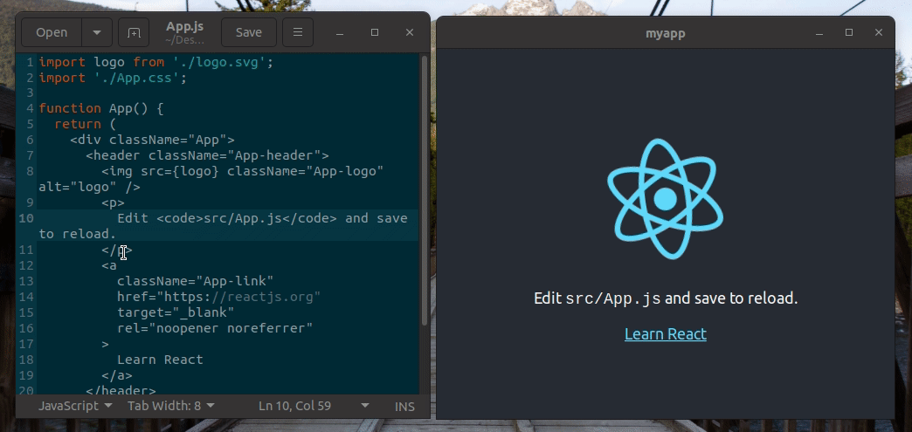

:::caution
This article is outdated and we are working on an article re-write. The reason is that now you can import [`@neutralinojs/lib`](https://www.npmjs.com/package/@neutralinojs/lib) in frontend libraries without using the global `Neutralino` object.
:::

You can build Neutralinojs apps with vanilla JavaScript or using any frontend library. This tutorial guides you
to set up your favorite frontend library for Neutralinojs application development.


## Initializing projects

First, you need to create a new empty Neutralinojs project. Use the
[`neutralinojs/neutralinojs-zero`](https://github.com/neutralinojs/neutralinojs-zero) template to create an
empty project, as shown below.

```bash
neu create myapp --template neutralinojs/neutralinojs-zero
```

Now, create a new project with your favorite frontend framework's command-line tools. In this tutorial,
we are going to use React, but you can use any frontend library as you wish.
You need to create this project inside the `myapp` directory.

```bash
cd myapp
npx create-react-app myapp-react
```
## Configuring Neutralinojs project

The `neutralinojs-zero` template has a pre-included HTML file and icon, so delete the `www` directory since we
don't need those files now.

```bash
rm -rf www
```

You need to configure the Neutralinojs project to support the frontend framework. First, you can set the
document root with your frontend framework's build directory. React typically generates build outputs to
`build` directory, so we can update `documentRoot` as follows.

```json
"documentRoot": "/myapp-react/build/"
```

Now, our Neutralinojs app knows the application resource location, but it's missing an icon, so set an
icon for the app. You can load an icon from your frontend framework's default resources directory. For
demonstration purposes, let's use the React icon from the `public` directory.

```json
  "modes": {
    "window": {
      // --- other options
      "icon": "/myapp-react/public/logo192.png"
    }
  }
```

## Configuring neu CLI

neu CLI wants to know about the client library location and resources directory to run
 `neu run` and `neu update` commands properly. Store client library into your frontend framework's static
 resources directory and set application resources path with the same value you've used for `documentRoot`.

We can configure CLI for React by using the following options.

```json
  "cli": {
    // --- other options
    "resourcesPath": "/myapp-react/build/",
    "clientLibrary": "/myapp-react/public/neutralino.js",
  }
```

When we modify `cli.clientLibrary` property, we need to enter `neu update` to get the client library to
the new location. Go to `myapp` and update the client library.

```bash
neu update
```

Now, you can build and run the React application as a Neutralinojs application &mdash; it's possible with the
following steps.

First, build the React application with the following command.

```bash
cd myapp-react
npm run build
```

Finally, run the Neutralinojs application.

```bash
cd ..
neu run
```

## Configuring the frontend app

You could run the application with the `neu run` command, but you can't use the native API yet since the
React application doesn't load the client library. Add a `<script>` tag and load the client library from
your frontend library's main HTML file.

React typically holds the main HTML file content in the `./public/index.html` file, so we can put the following
HTML snippet there to load the client library.

```html
<script src="%PUBLIC_URL%/neutralino.js"></script>
```

Also, make sure to initialize the client library from your frontend application's entry point. React's
application entry-point is typically `./src/index.js`. Therefore, we can do the initialization process
from there.


```jsx
import React from 'react';
import ReactDOM from 'react-dom';
import './index.css';
import App from './App';

ReactDOM.render(
  <React.StrictMode>
    <App />
  </React.StrictMode>,
  document.getElementById('root')
);

window.Neutralino.init(); // Add this function call
```

Now, build and run your application again with the inspector window.

```bash
neu run -- --window-enable-inspector
```

Try entering some native API calls from the browser console.


## Enabling hot-reload

Building every code change and testing your application is undoubtedly time-consuming. Therefore, you can use
your frontend framework's HMR (Hot Module Replacement) features to speed up your development activities.
But, we have a small issue here. There are now two HTTP servers: the Neutralinojs resource server and the
frontend framework's development server. How can we load the Neutralinojs client library from the frontend
framework's development server?

Don't worry &mdash; neu CLI provides a built-in feature to enable HMR by patching the main HTML file.
You can add the following section to your configuration file for activating hot-reloading.

```json
  "cli": {
    // --- other options
    "frontendLibrary": {
        "patchFile": "/myapp-react/public/index.html",
        "devUrl": "http://localhost:3000"
    }
  }
}
```

The above options tell neu CLI about the main HTML file and development server URL.

Now, start your frontend development server. In React, we can do it with the following command.

```bash
npm start
```

Finally, run the Neutralinojs application with the following command.

```
neu run --frontend-lib-dev
```



Make sure to build your frontend app once before entering the above command since it loads the client
library from the Neutralinojs application resources directory (not from your frontend framework's directory).

See the full source code of this tutorial [here](https://github.com/codezri/neutralinojs-react).


